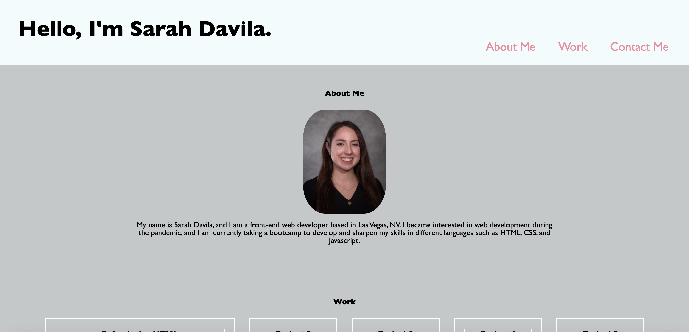

# Sarah-Davila-Portfolio
Welcome to my professional portfolio.

## Description

This is a webpage displaying information about myself, showcasing all of the projects that I have completed throughout the bootcamp, and providing links of the best ways to contact me. 

## Installation

N/A

## Usage

To use this webpage, you can click the navigation links in the header, and you can review the information in each section. About me takes you to the section describing a little bit about myself. Work will take you to a list of my current projects. The largest project is has a working link which will direct you to the github repository for that project. The other 4 projects are just placeholder images for now. Finally, contact me will take you to the footer where there are links that provide information with the best ways to contact me.

## Assets

The following image demonstrates the web application's appearance:

Here is the link to the deployed application:

## Credits

I used the codes from module one challenge and module two mini-project as inspiration and examples. I also used developer.mozilla.org to assist with the coding. (especially for flexbox)

## License

MIT License (Please refer to license in repo)